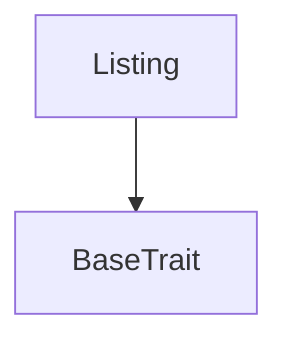

# Tact compilation report
Contract: Listing
BoC Size: 1008 bytes

## Structures (Structs and Messages)
Total structures: 18

### DataSize
TL-B: `_ cells:int257 bits:int257 refs:int257 = DataSize`
Signature: `DataSize{cells:int257,bits:int257,refs:int257}`

### SignedBundle
TL-B: `_ signature:fixed_bytes64 signedData:remainder<slice> = SignedBundle`
Signature: `SignedBundle{signature:fixed_bytes64,signedData:remainder<slice>}`

### StateInit
TL-B: `_ code:^cell data:^cell = StateInit`
Signature: `StateInit{code:^cell,data:^cell}`

### Context
TL-B: `_ bounceable:bool sender:address value:int257 raw:^slice = Context`
Signature: `Context{bounceable:bool,sender:address,value:int257,raw:^slice}`

### SendParameters
TL-B: `_ mode:int257 body:Maybe ^cell code:Maybe ^cell data:Maybe ^cell value:int257 to:address bounce:bool = SendParameters`
Signature: `SendParameters{mode:int257,body:Maybe ^cell,code:Maybe ^cell,data:Maybe ^cell,value:int257,to:address,bounce:bool}`

### MessageParameters
TL-B: `_ mode:int257 body:Maybe ^cell value:int257 to:address bounce:bool = MessageParameters`
Signature: `MessageParameters{mode:int257,body:Maybe ^cell,value:int257,to:address,bounce:bool}`

### DeployParameters
TL-B: `_ mode:int257 body:Maybe ^cell value:int257 bounce:bool init:StateInit{code:^cell,data:^cell} = DeployParameters`
Signature: `DeployParameters{mode:int257,body:Maybe ^cell,value:int257,bounce:bool,init:StateInit{code:^cell,data:^cell}}`

### StdAddress
TL-B: `_ workchain:int8 address:uint256 = StdAddress`
Signature: `StdAddress{workchain:int8,address:uint256}`

### VarAddress
TL-B: `_ workchain:int32 address:^slice = VarAddress`
Signature: `VarAddress{workchain:int32,address:^slice}`

### BasechainAddress
TL-B: `_ hash:Maybe int257 = BasechainAddress`
Signature: `BasechainAddress{hash:Maybe int257}`

### EscrowNFT
TL-B: `escrow_nft#e5bf89e9 collectibleId:int257 creator:address priceUsdt:int257 listingType:int257 endTime:int257 = EscrowNFT`
Signature: `EscrowNFT{collectibleId:int257,creator:address,priceUsdt:int257,listingType:int257,endTime:int257}`

### CancelListing
TL-B: `cancel_listing#bb03c6bd  = CancelListing`
Signature: `CancelListing{}`

### BuyNFT
TL-B: `buy_nft#4d87b8fe  = BuyNFT`
Signature: `BuyNFT{}`

### NftTransfer
TL-B: `nft_transfer#6d9fc3b7 queryId:uint64 newOwner:address responseDestination:address customPayload:Maybe ^cell forwardAmount:coins forwardPayload:remainder<slice> = NftTransfer`
Signature: `NftTransfer{queryId:uint64,newOwner:address,responseDestination:address,customPayload:Maybe ^cell,forwardAmount:coins,forwardPayload:remainder<slice>}`

### ListingData
TL-B: `_ collectibleId:int257 nftAddress:address seller:address creator:address buyer:address platformWallet:address usdtMaster:address priceUsdt:int257 listingType:int257 endTime:int257 active:bool highestBid:int257 highestBidder:address ownershipAssignedCount:int257 fallbackCount:int257 = ListingData`
Signature: `ListingData{collectibleId:int257,nftAddress:address,seller:address,creator:address,buyer:address,platformWallet:address,usdtMaster:address,priceUsdt:int257,listingType:int257,endTime:int257,active:bool,highestBid:int257,highestBidder:address,ownershipAssignedCount:int257,fallbackCount:int257}`

### Listing$Data
TL-B: `_ data:ListingData{collectibleId:int257,nftAddress:address,seller:address,creator:address,buyer:address,platformWallet:address,usdtMaster:address,priceUsdt:int257,listingType:int257,endTime:int257,active:bool,highestBid:int257,highestBidder:address,ownershipAssignedCount:int257,fallbackCount:int257} = Listing`
Signature: `Listing{data:ListingData{collectibleId:int257,nftAddress:address,seller:address,creator:address,buyer:address,platformWallet:address,usdtMaster:address,priceUsdt:int257,listingType:int257,endTime:int257,active:bool,highestBid:int257,highestBidder:address,ownershipAssignedCount:int257,fallbackCount:int257}}`

### CreateListing
TL-B: `create_listing#78f6efc6 collectibleId:int257 nftAddress:address creator:address priceUsdt:int257 listingType:int257 endTime:int257 = CreateListing`
Signature: `CreateListing{collectibleId:int257,nftAddress:address,creator:address,priceUsdt:int257,listingType:int257,endTime:int257}`

### MarketplaceRoot$Data
TL-B: `_ owner:address platformWallet:address usdtMaster:address = MarketplaceRoot`
Signature: `MarketplaceRoot{owner:address,platformWallet:address,usdtMaster:address}`

## Get methods
Total get methods: 7

## is_active
No arguments

## get_seller
No arguments

## get_price
No arguments

## get_creator
No arguments

## get_listing_data
No arguments

## get_fallback_count
No arguments

## get_buyer
No arguments

## Exit codes
* 2: Stack underflow
* 3: Stack overflow
* 4: Integer overflow
* 5: Integer out of expected range
* 6: Invalid opcode
* 7: Type check error
* 8: Cell overflow
* 9: Cell underflow
* 10: Dictionary error
* 11: 'Unknown' error
* 12: Fatal error
* 13: Out of gas error
* 14: Virtualization error
* 32: Action list is invalid
* 33: Action list is too long
* 34: Action is invalid or not supported
* 35: Invalid source address in outbound message
* 36: Invalid destination address in outbound message
* 37: Not enough Toncoin
* 38: Not enough extra currencies
* 39: Outbound message does not fit into a cell after rewriting
* 40: Cannot process a message
* 41: Library reference is null
* 42: Library change action error
* 43: Exceeded maximum number of cells in the library or the maximum depth of the Merkle tree
* 50: Account state size exceeded limits
* 128: Null reference exception
* 129: Invalid serialization prefix
* 130: Invalid incoming message
* 131: Constraints error
* 132: Access denied
* 133: Contract stopped
* 134: Invalid argument
* 135: Code of a contract was not found
* 136: Invalid standard address
* 138: Not a basechain address
* 2374: Not seller
* 30531: Listing not active
* 50507: Invalid price
* 54167: Only NFT

## Trait inheritance diagram

## Contract dependency diagram

